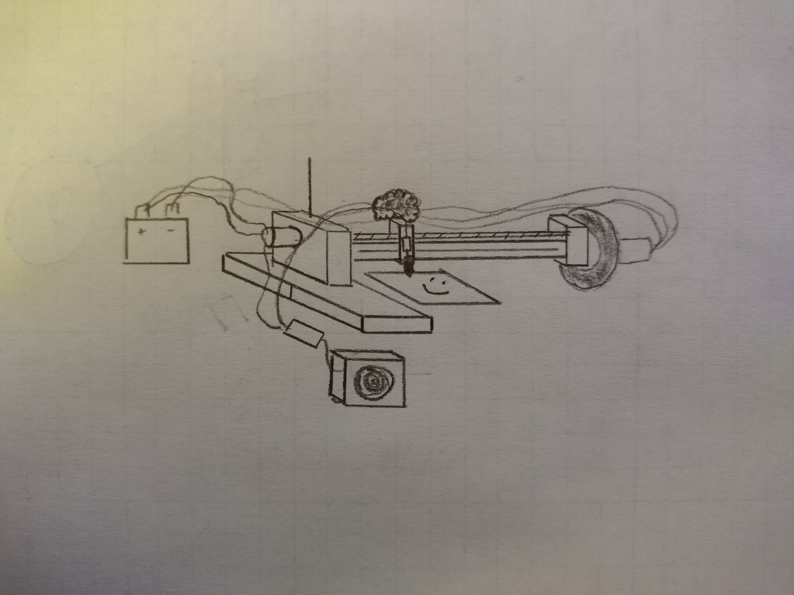

# Bob Ross Bot

Our term project is a Bob Ross Bot. Much like the real Bob Ross, this robot
will take you on a journey through guided painting lessons, supplemented by
(ai-generated) verbal instructions to help you feel like you're talking to 
the real Bob Ross.

This robot will have a motor that rotates an arm across a piece of paper, a
motor that will rotate a screw which in turn linearly translates a block 
holding a pen across said arm, and will use a solenoid that brings a pen 
(or other writing utensil) to the medium it is drawing on. 

Here is a small schematic that shows what the final result should look like:

Below is a Bill of Materials that list all the parts we need for this project:
| Qty. | Part                               | Source                | Est. Cost |
|:----:|:-----------------------------------|:----------------------|:---------:|
|  1   | Nucleo with Shoe                   | ME405 Tub             |     -     |
|  2   | Pittperson Gearmotors              | ME405 Tub             |     -     |
|  1   | Solenoid Actuator                  | Online/store          |   ~$20    |
|  1   | Speaker                            | Online/store          | $6-12     |
|  1   | Black Sharpie&trade;               | Home                  |   -       |
|  1   | Long Screw                         | Lab Scrap             |   -       |
|  2   | Aluminum Rod (arm & swivel)        | Lab Scrap             | -         |
|  6?  | nuts                               | Lab Scrap             |   -       |
|  1   | Wheel (3-4 inch diameter)          | Online/store          |   $15-30  |
|  ?   | Wood                               | Lab Scrap             |   -       |
|  ?   | Hose Clamp                         | Online/store          |   X       |
|  2   | Limit switches                     | Online/store          |   X       |
