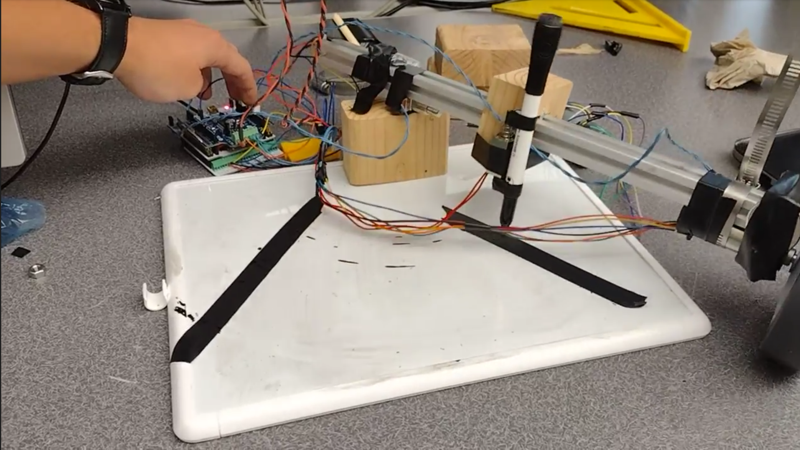

# Bob Ross Bot

Our term project is a Bob Ross Bot. Much like the real Bob Ross, this robot
will take you on a journey through guided painting lessons, supplemented by
(ai-generated) verbal instructions to help you feel like you're talking to 
the real Bob Ross.

This robot will have a motor that rotates an arm across a piece of paper, a
motor that will rotate a screw which in turn linearly translates a block 
holding a pen across said arm, and will use a solenoid that brings a pen 
(or other writing utensil) to the medium it is drawing on. 

Here is a small schematic that shows what the final result should look like:

The final Product looks like so:

Our design uses two motors, a solenoid, and two limit switches. One motor is used
to turn the screw which pushes the carriage along the arm, controlling the R portion
of R and Theta. This motor is attached to the arm near the base, on the opposite
side of the arm in the above picture.

The other motor is mounted to the end of the arm, hanging below. This motor drives
the wheel and this is how we get our angle. Turning the arm from the end of it 
provides more accuracy in angle measurments. 

The solenoid is mounted on the outisde of the carriage and a whiteboard marker is
attached. The solenoid is powered with 12V and actuation is controlled with a power 
mosfet.

There are three tasks: one for each motor and one for the solenoid. The motor tasks
will work to move the pen to the correct theta and R position, and the solenoid task
will turn on or off the solenoid, depending on if it should be drawing or moving to
a new position.

Here is a link to the [Doxygen](https://mechatronics-calpoly-winter-2022.github.io/Bob-Ross-Bot/) page with more information on the software architecture
.

The end result of our project is not quite what we would have hoped. The quality of 
the parts was sub-par, which resulted in error and looseness in some of the components.
The reasoning behind the parts chosen was to make a financially efficient design.
However to make this successful, a team with more of a background in mechanical design
would be needed to truly make this design work. Our general inexperience with mechanics
combined with inferior parts resulted in a robot that did not meet initial expectations.

If a team were to continue work on this project, further work on the mechanical 
design would be necessary. 

Below is a Bill of Materials that list all the parts we need for this project:
| Qty. | Part                               | Source                | Est. Cost |
|:----:|:-----------------------------------|:----------------------|:---------:|
|  1   | Nucleo with Shoe                   | ME405 Tub             |     -     |
|  2   | Pittperson Gearmotors              | ME405 Tub             |     -     |
|  1   | Solenoid Actuator                  | Online/store          |   ~$20    |
|  1   | Black Sharpie&trade;               | Home                  |   -       |
|  1   | Long Screw                         | Lab Scrap             |   -       |
|  2   | Aluminum Rod (arm & swivel)        | Lab Scrap             | -         |
|  5   | nuts                               | Lab Scrap             |   -       |
|  1   | Wheel (4 inch diameter)            | Online/store          |   $8      |
|  ?   | Wood                               | Lab Scrap             |   -       |
|  1   | Hose Clamp                         | Online/store          |   $2      |
|  2   | Limit switches                     | Online/store          |   $2      |
